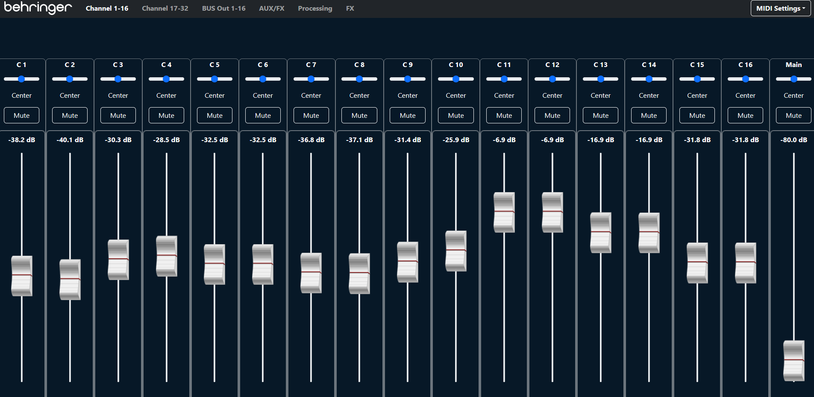

# DDX3216 GUI



A **web-based control interface** for the **Behringer DDX3216 digital mixer**, built with **React + Vite**.

This project provides real-time control over mixer parameters via **MIDI / SysEx**, with a UI inspired by traditional digital mixing consoles.

The main motivation for this work comes from the excellent reverse-engineering and documentation effort found here:  
👉 **https://github.com/wherget/ddx3216http**

This GUI builds on those findings to offer a modern, browser-based control surface.

---

## Features

Currently implemented:

- 🎚 **Channel faders** with accurate logarithmic dB scaling
- 🎛 **Pan control**
- 🔇 **Mute**
- 📊 **Visual dB scale** aligned to fader travel
- 🔁 **Bidirectional MIDI/SysEx communication**

Planned / upcoming:

- Solo
- EQ controls
- Bus sends
- Scene recall
- Preset management
- Improved MIDI device discovery
- UI refinements and performance optimizations

---

## Tech Stack

- **React**
- **Vite** (fast dev server with HMR)
- **JavaScript**
- **Web MIDI API**
- **SVG & CSS** for precise fader and scale rendering

---

## Prerequisites

Make sure you have:

- **Node.js** (v18+ recommended)
- **npm** (comes with Node.js)

Check versions:

```bash
node -v
npm -v
```

---

## Installation

```bash
npm install
```

---

## Development

Start the development server with Hot Module Replacement (HMR):

```bash
npm run dev
```

Then open your browser at:

```
http://localhost:5173
```

---

## Production Build

```bash
npm run build
```

Preview the production build locally:

```bash
npm run preview
```

---

## Useful npm Commands

| Command           | Description                    |
| ----------------- | ------------------------------ |
| `npm install`     | Install project dependencies   |
| `npm run dev`     | Start development server (HMR) |
| `npm run build`   | Build for production           |
| `npm run preview` | Preview production build       |
| `npm run lint`    | Run ESLint checks              |

---

## Deploy to GitHub Pages

There are two common ways to deploy a Vite app to GitHub Pages.

### Option A: GitHub Actions (recommended)

1. **Set the correct base path** for your repository in `vite.config.js`:

```js
import { defineConfig } from "vite";
import react from "@vitejs/plugin-react";

export default defineConfig({
  plugins: [react()],
  base: "/<YOUR_REPO_NAME>/",
});
```

2. Create this workflow file at `.github/workflows/deploy.yml`:

```yml
name: Deploy to GitHub Pages

on:
  push:
    branches: ["main"]

permissions:
  contents: read
  pages: write
  id-token: write

concurrency:
  group: "pages"
  cancel-in-progress: true

jobs:
  build:
    runs-on: ubuntu-latest
    steps:
      - uses: actions/checkout@v4

      - uses: actions/setup-node@v4
        with:
          node-version: 20
          cache: "npm"

      - run: npm ci
      - run: npm run build

      - uses: actions/upload-pages-artifact@v3
        with:
          path: dist

  deploy:
    environment:
      name: github-pages
      url: ${{ steps.deployment.outputs.page_url }}
    runs-on: ubuntu-latest
    needs: build
    steps:
      - id: deployment
        uses: actions/deploy-pages@v4
```

3. In your GitHub repo settings:
   - Go to **Settings → Pages**
   - Under **Build and deployment**, select **GitHub Actions**.

After pushing to `main`, GitHub will build and publish your site automatically.

### Option B: Manual deploy (dist folder)

1. Build locally:

```bash
npm run build
```

2. Publish the `dist/` folder to a branch (commonly `gh-pages`) or configure Pages to serve from `docs/`.
   This approach is simpler but less automated than GitHub Actions.

---

## MIDI / SysEx Notes

- Requires a MIDI interface that supports **SysEx**
- Mixer firmware and MIDI settings must allow external control
- Designed primarily for **local studio / LAN use**

---

## Project Status

🚧 **Work in Progress**

This project is actively evolving. APIs, UI, and internal structure may change.

---

## Acknowledgements

Special thanks to the work done in:

- **https://github.com/wherget/ddx3216http**

This project would not be possible without the documentation and experimentation shared there.

---

## License

MIT License — see [LICENSE](./LICENSE).
